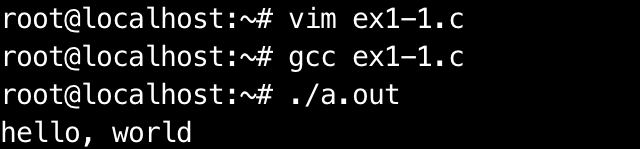

# Re-learning C

At university I (badly) completed a few courses that used C as the language of choice in the course. One of those courses, in first year was the course in which I was suppose to 'learn' the language. It was a six week block in which I learnt enough to get started in the subsequent embedded development courses. Needless to say, I only ever learnt just enough to get by and spent many an hour confused by when I was modifying the contents of pointer location of the pointer itself. 

I did however enjoy the language, and I finally decided to devote some time into brushing up. Potentially needlessly, I have decided to start by going cover to cover through everyones favourite, "The C Programming Language". 

Regardless of how trivial, I will be posting every exercise and my related notes as a personal record of progress. 

To this end,
> **Exercise 1-1.** Run the "hello, world" program on your system. Experiment with leaving out parts of the program to see what error messages you get. [x]

```c
#include <stdio.h>

int main(void)
{
	printf("hello, world\n");
}
```

Compiling with gcc using command:

```bash
gcc ex1-1.c
```
and running with:

```bash
./a.out
```
yields:

TODO: image of terminal output


Exercise